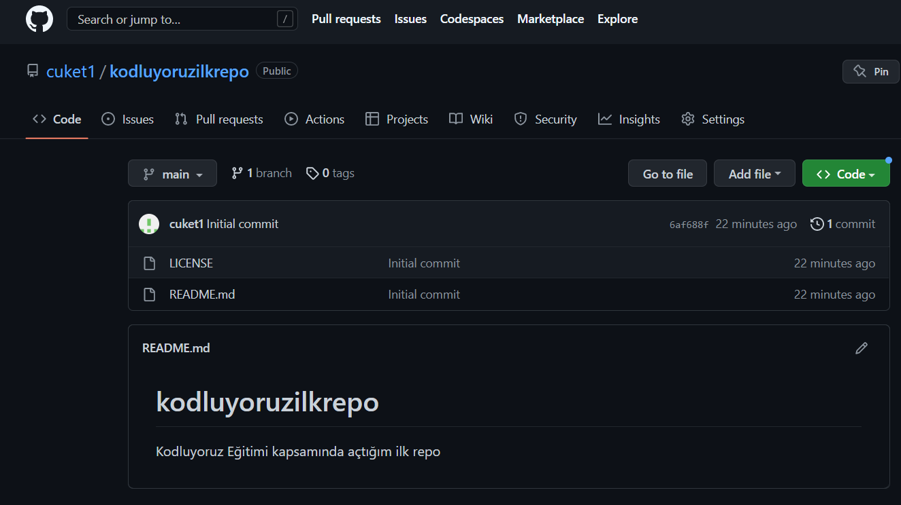

# Kodluyoruz İlk Repo

Kodluyoruz Eğitimi kapsamında açtığım ilk repo. 

Bu repo içerisinde bir adet README dosyası, bir adet de index.html barındırıyor. 
## Kurulum

GitHub üzerinde kurduğumuz repoyu git clone komutuyla lokalimize çekiyoruz. 

` git clone https://github.com/cuket1/kodluyoruzilkrepo.git `

VSCode üzerinde README dosyasını hazırlayıp, .html uzantılı bir dosya oluşturduktan sonra hazırsınız. 

***İyi eğlenceler!***
